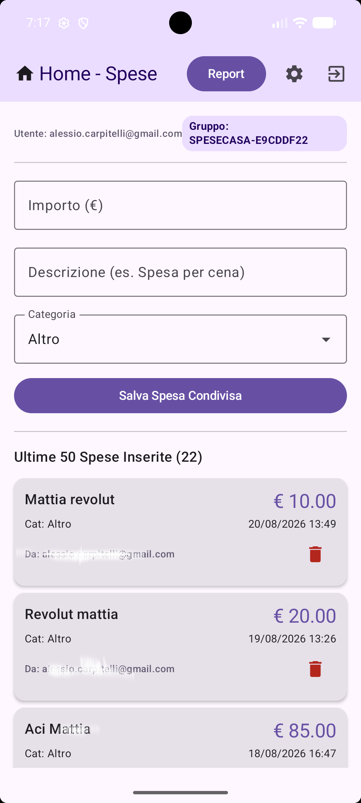
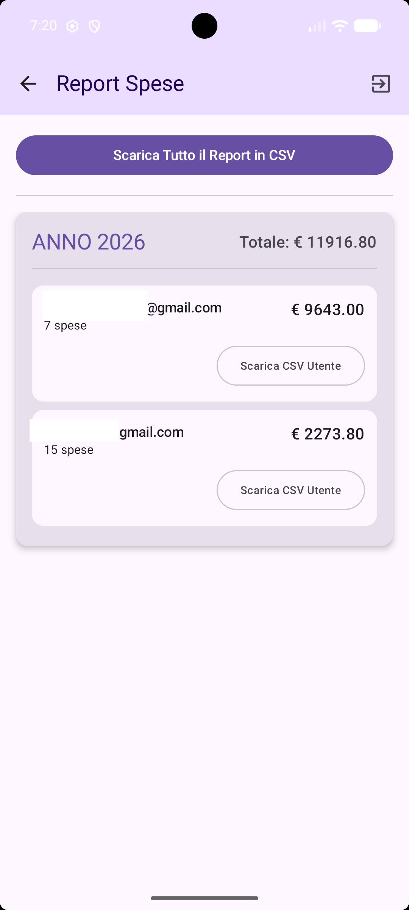

# RegistraSpese - App Android

Un'applicazione nativa per la gestione delle spese condivise, sviluppata in Kotlin con architettura MVVM e Jetpack Compose.

**Funzionalità Principali**
* Login sicuro tramite account Google.
* Sincronizzazione in tempo reale tramite Firebase Firestore.
* Privacy garantita dalla Crittografia End-to-End (AES 256-bit) per descrizioni e categorie.
* Generazione di report finanziari esportabili in formato CSV.
* Sistema a stanze condivise con codici di sicurezza e Pannello Amministratore.

**Come Compilare il Progetto**
* Clona questo repository e apri il progetto in Android Studio.
* Crea un progetto nella Firebase Console e registra la tua app Android.
* Scarica il file `google-services.json` e posizionalo nella cartella `app`.
* Abilita Firebase Authentication (provider Google) e Firestore Database.
* Imposta le regole di sicurezza Firestore per consentire la lettura e scrittura solo agli utenti loggati.
* Compila ed esegui l'app premendo il tasto Run in Android Studio.

**Utilizzo dell'Applicazione**
* Avvia l'app ed esegui l'accesso.
* Crea un nuovo gruppo per diventarne Amministratore o inserisci un codice per unirti a una stanza.
* Registra le spese, condividi il codice con i membri o scarica il CSV dei report direttamente dal tuo smartphone.
## Screenshot dell'App

Qui sotto puoi vedere alcune schermate principali dell'applicazione in azione:

  
  &nbsp;&nbsp;&nbsp;&nbsp;

  

